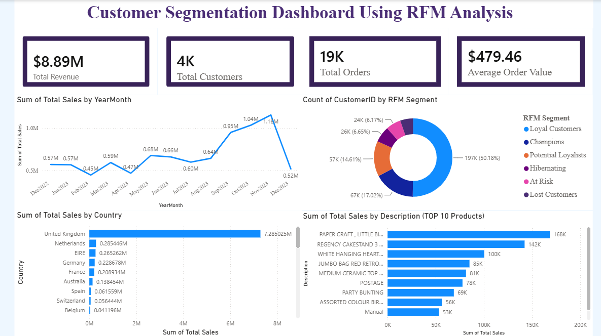

# Customer Segmentation using RFM Analysis

## 📌 Project Overview

Customer Segmentation using RFM Analysis is an academic project developed using Microsoft Power BI.

The project analyzes customer purchasing behavior using the RFM (Recency, Frequency, Monetary) technique and groups customers into meaningful segments. The analysis is presented through an interactive Power BI dashboard.

## 🎯 Objectives

- Analyze customer purchasing behavior
- Calculate Recency, Frequency, and Monetary values
- Segment customers based on RFM analysis
- Identify different customer groups
- Present the analysis using an interactive dashboard

## 📊 What is RFM Analysis?

RFM Analysis is a customer segmentation technique based on three factors:

### Recency
Measures how recently a customer made a purchase.

### Frequency
Measures how frequently a customer made purchases.

### Monetary
Measures how much money a customer spent.

## 📈 Dashboard

The Power BI dashboard includes:

- RFM metric cards
- RFM segment distribution
- Recency vs Monetary Value analysis
- Frequency vs Monetary analysis
- Customer ID vs Segment table
- RFM Score and customer-level information

### Dashboard Preview



## 🛠️ Tools & Technologies

- Microsoft Power BI
- Power Query
- Data Visualization
- RFM Analysis

## 📁 Project Structure

```text
Customer-Segmentation-RFM-Analysis/
│
├── CustomerSegmentation_RFM.pbix
├── dashboard-overview.png
└── README.md
